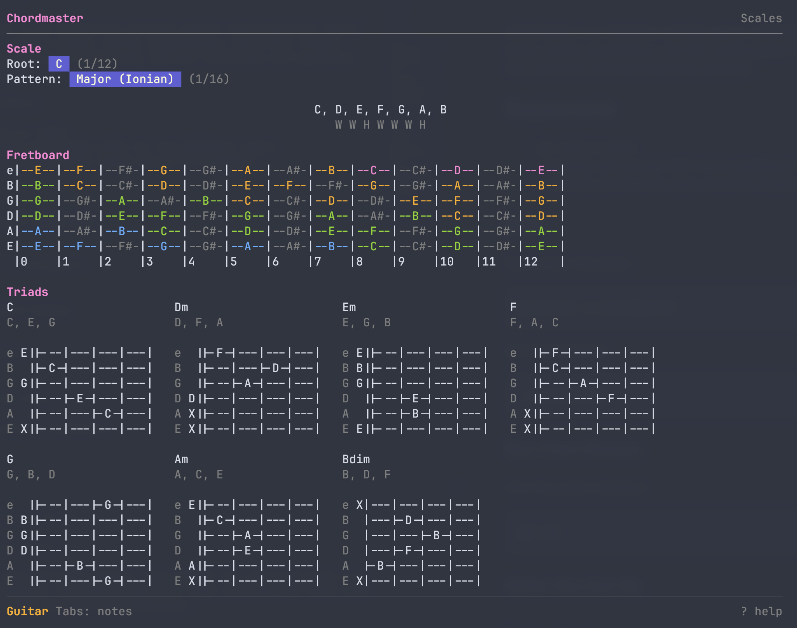
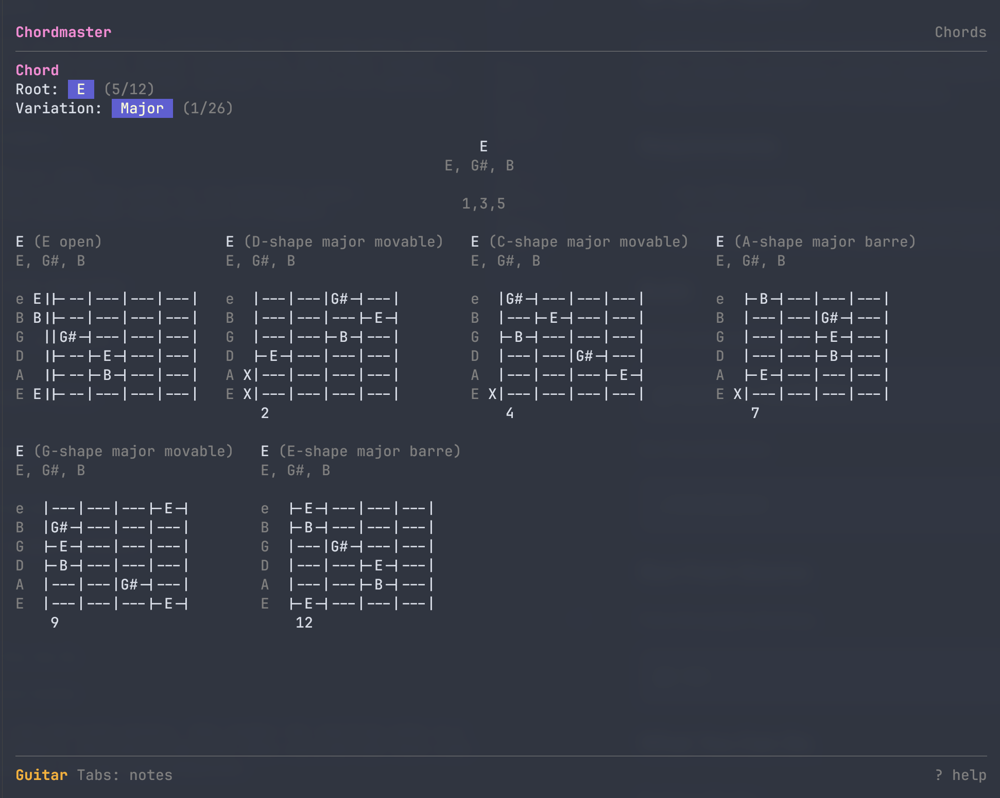
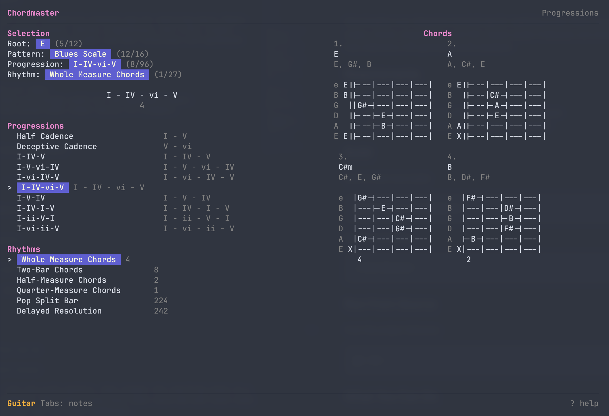

# Chordmaster

```text
   ____ _                     _                     _
  / ___| |__   ___  _ __   __| |_ __ ___   __ _ ___| |_ ___ _ __
 | |   | '_ \ / _ \| '__| / _` | '_ ` _ \ / _` / __| __/ _ \ '__|
 | |___| | | | (_) | |   | (_| | | | | | | (_| \__ \ ||  __/ |
  \____|_| |_|\___/|_|    \__,_|_| |_| |_|\__,_|___/\__\___|_|
```

When I started learning how to play guitar, I stumbled over music theory and my head almost exploded. I really struggled to keep all the scales, chords and progressions - and their relations - in my head. So I decided to make a little tool that helps me to explore my instrument.

Chordmaster is an interactive terminal app for exploring music theory on guitar. Browse scales, chords, progressions, and riffs; inspect guitar fretboards and chord tabs; and hear selections with generated audio playback.

Currently only guitar is supported, but maybe I'll add piano and ukulele in the future.

## Requirements

- Go 1.26.2 or newer.
- A terminal with enough width for the dashboard layout.
- A working system audio output device for playback.

## Build

Build a local executable:

```sh
go build -o chordmaster .
```

Run the built binary:

```sh
./chordmaster
```

## Run From Source

From the project directory:

```sh
go run .
```

## What You Can Do

### Explore Scales

Choose a root and scale pattern, then inspect the resulting notes on a guitar fretboard. The scale screen also shows scale-derived chord cards so you can hear how the scale harmonizes.



Useful actions:

- Use `h` / `l` to change the selected root or pattern.
- Press `p` to play the scale ascending.
- Press `c` to play the scale-derived chords.
- Press `p` during highlighted playback to cancel.

### Browse Chords

Choose a root and chord variation, then browse the available guitar voicings for that chord. Chord diagrams can show either note names or finger numbers.



Useful actions:

- Use `h` / `l` to change the selected root or variation.
- Press `p` to play the selected chord.
- Press `f` to switch chord diagrams between note names and finger numbers.

### Work With Progressions

Combine a scale, progression pattern, and rhythm pattern. Chordmaster resolves the progression into concrete chords, shows guitar chord cards for the result, and can play the timed chord sequence.



Useful actions:

- Use `[` / `]` to change the progression root.
- Use `,` / `.` to change the rhythm pattern.
- Use movement keys to change the selected progression and scale context.
- Press `p` to play the resolved chord sequence.

### Play Riffs

Browse original guitar riff exercises with note timing. Select a riff and press `p` to hear it.

## Chord Tabs

Chord diagrams render strings from high to low:

```txt
e B G D A E
```

Muted strings are shown as `X`. Open strings are shown at the nut. Shifted chord shapes show the starting fret below the diagram.

Press `f` to switch between:

- Note mode: fretted positions show note names.
- Finger mode: fretted positions show finger numbers.

## Playback

Chordmaster generates audio in real time. It does not use audio samples or external sound files.

- Scales play ascending at 400ms per note.
- Chords play all notes simultaneously for 1200ms.
- Progressions play timed chord sequences using the selected rhythm pattern.
- Riffs play timed note events from the riff catalog.
- Playback uses a short fade-in and fade-out to reduce clicks.

## Controls

| Key | Action |
| --- | --- |
| `enter` / `space` | Continue from splash, open selected menu item |
| `j` / `down` | Move down |
| `k` / `up` | Move up |
| `h` / `left` | Move left or previous value |
| `l` / `right` | Move right or next value |
| `p` | Play the selected scale, chord, progression, or riff |
| `p` while highlighted scale playback is active | Cancel playback |
| `c` | Play scale-derived chords on the scale screen |
| `f` | Toggle guitar chord tabs between notes and finger numbers |
| `[` / `]` | Change progression root |
| `,` / `.` | Change progression rhythm |
| `pgup` / `pgdn` | Scroll content |
| `home` / `end` | Jump to top or bottom of scrollable content |
| `?` | Toggle help |
| `esc` | Return to the main menu or close help |
| `q` / `ctrl+c` | Quit |

## Development

Run the standard checks before submitting changes:

```sh
gofmt -w .
go mod tidy
go test ./...
```

Package boundaries and implementation notes live in `docs/architecture.md`.

## License

Chordmaster is released under the MIT License. See `LICENSE` for details.
